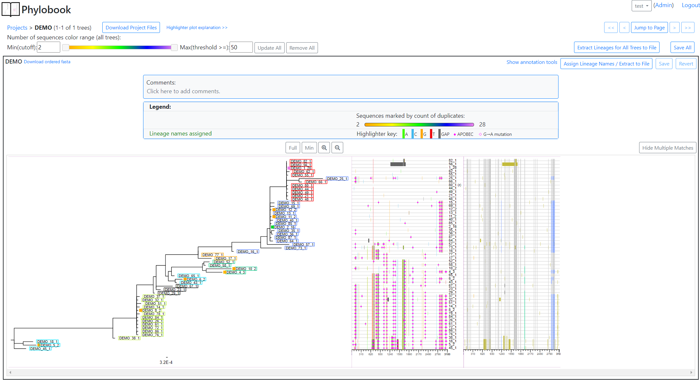
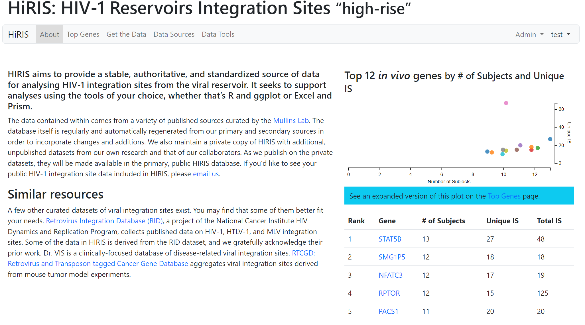
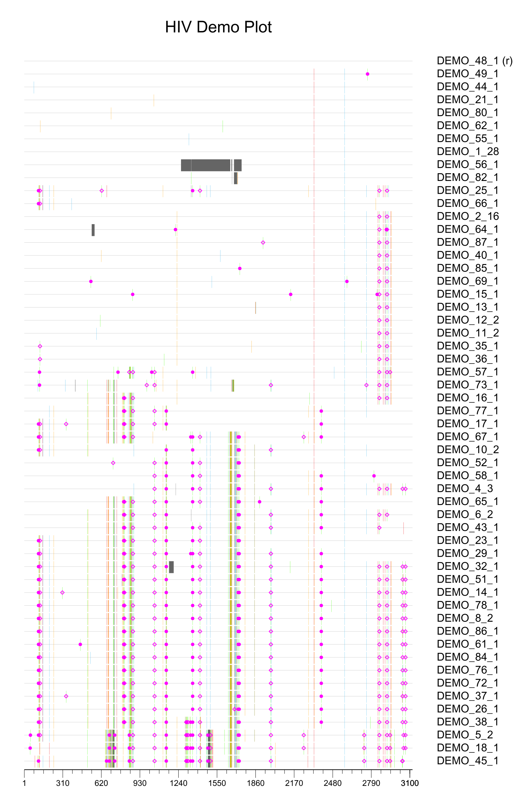

# Peter Darley
I have just finished working at the [Cohn Lab](https://research.fredhutch.org/cohn/en.html) at the [Fred Hutchinson Cancer Center](https://www.fredhutch.org/en.html).  I just moved there from the [Mullins Retrovirology Lab](https://mullinslab.microbiol.washington.edu/) at the [University of Washington Department of Microbiology](https://microbiology.washington.edu/uw-microbiology-home).  I was continuing the work I started at the Mullins Lab; I develop tools for the collection, distribution, and analysis of scientific data.  The projects I've worked on here are:

## Full Applications
Some of these are available at the [Mullins Lab GitHub page](https://github.com/MullinsLab)

### Phylobook
[Phylobook GitHub Repo](https://github.com/MullinsLab/phylobook)

Phylobook is a tool to display related sequences (nucleotides or amino acids) using a phylogenitic tree, a mismatched plot (Highlighter) that displayes differences from a reference sequences, and a matched plot that shows similarities to consensus sequences for the lineages assigned by the user.  This functionality is used to generate lineage information for each sequence.  In the Mullins Lab this information is being applied to the question of how many strains of HIV are people being exposed to on initial infection.

The [Phylobook journal article](https://doi.org/10.2144/btn-2023-0056) in Biotechniques.

Phylobook is fed data from the Phylobook_Pipeline, which is mostly written by my coleague, Wenjie Deng, but toward which I contributed a small amount of work. ([GitHub Repo](https://github.com/MullinsLab/phylobook_pipeline))

### HiRIS - HIV-1 Reservoirs Integration Sites “high-rise”
[HiRIS GitHub Repo](https://github.com/MullinsLab/hiris_project)

I am the sole contributor to HiRIS, a tool to collect and display viral integration sights, specifically HIV integration sights.  Based on the [ISDB](https://mullinslab.microbiol.washington.edu/isdb/) implimentation of a previous [HiRIS tool](https://mullinslab.microbiol.washington.edu/hiris/), the project includes an entirely new PostgreSQL data base design, and all new code, with the goal of increasing the variety of sequence data collected, including the provirus sequence, adding data access rules, and allowing for importing data by the users.  

### Viroverse
Viroverse GitHub Repo is private until completion

Viroverse is a platform for the collection, storage, retrieval, and analysis of experimental data for laboratory workflows. Developed in-house for twelve years, it serves as the principal data store for HIV sequencing experiments conducted in the Mullins Lab. Viroverse currently houses tens of thousands of viral nucleotide sequences, together with comprehensive metadata about their creation including PCR protocols, gel images, subject clinical data, and more.

I am involved in a ground-up rewrite in Python and Django where the goal is to make it more flexible and to give it better data management tools in an effort to eliminate manual changes to the database and improve workflow.

## Reusable Open Source Components

### Highlighter
[Highlighter GitHub Repo](https://github.com/MullinsLab/Highlighter)

Hilighter is a pure Python extension to [Biopython](https://github.com/biopython/biopython) to detect point mutations in the members of a sequence alignment, and to plot either matching or mismatched nucleotides or amino acids.  It's written with a focus on adjustable formatting.

This is a rewrite of the excelent web based [LANL Highlighter ](https://www.hiv.lanl.gov/content/sequence/HIGHLIGHT/highlighter_top.html) tool.

Hilighter is currently needing more documentation before it gets submitted to Biopython, so I am monkey patching it at the moment.  My hope is that it will be part of the standard Biopython at some point.

### ML Import Wizard
[ML_Import_Wizard GitHub Repo](https://github.com/MullinsLab/ML_Import_Wizard)

ML Import Wizard is a user facing Django app that takes flat square data files, or linked flat square data files, and decomposes them for importing into a Django ORM.  One of the weaknesses of an ORM is that while it does a good job turning data tables into objects, they are not great at composing objects into larger structures.  Toward this end ML Import Wizard uses introspection to observe Django models and their relationships, and uses that information to create needed Django objects from the import.

It is designed to take input data files as they are, associating fields with Django model attributes, including the ability to combine, split, and transform data in fields to fit them into the ORM.  It will allow importing into many (dozens or hundreds of) models at a time.  It will import data coherently across multiple apps.

As a user facing tool, it is designed to allow end users to manage their own data imports without having to go to the database back end or use the Admin tools.

### ML Export Wizard
[ML_Export_Wizard GitHub Repo](https://github.com/MullinsLab/ML_Export_Wizard)

ML Export Wizard is a Django app that composes flat square data structures from Django ORM models.  It is designed to shore up a weakness of an ORM where it is hard to link models into larger data structures that span many objects, as well as multiple apps.  These flat data structures are very useful for building HTML tables that span multiple models, as well as exporting data to flat files.

Resulting data structures are queryable, sortable, and since they generate only a single database query, they are fast.

The tool uses introspection to understand the Django models used and establish their relationships.  It does this when the server is run, so it will detect any changes to models without need to update settings.

